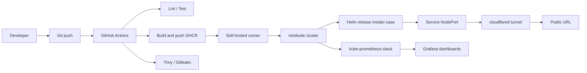

# Architecture — Track B

## Components

| Component | Role |
|-----------|------|
| **Go service** | `/ping`, `/healthz`, `/version`, `/metrics` |
| **Helm** | Deployment, Service, ServiceMonitor |
| **minikube** | Local Kubernetes (Track B) |
| **GHCR** | Immutable `sha-<commit>` image tags |
| **cloudflared** | Outbound-only public exposure |
| **kube-prometheus-stack** | Prometheus, Grafana, Alertmanager |

Reproducible cluster bootstrap: `make track-b-setup` or `scripts/track-b-setup.sh`.
